# Shopping App

A comprehensive Flutter-based e-commerce application designed to get hands-on with Flutter concepts. It features user authentication, product browsing, cart management, and order tracking, integrating essential e-commerce features into a single, intuitive interface.

## Getting Started

This project is a starting point for a Flutter application.

### Prerequisites

- [Flutter SDK](https://docs.flutter.dev/get-started/install) (latest stable version)
- [Dart SDK](https://dart.dev/get-dart)
- An IDE (Android Studio, VS Code, or IntelliJ)

### Installation

1. **Clone the repository:**
   ```bash
   git clone https://github.com/sankets-iprogrammer/shopping_app.git
   cd shopping_app
   ```

2. **Install dependencies:**
   ```bash
   flutter pub get
   ```

3. **Run the application:**
   ```bash
   flutter run
   ```

## Usage

- **Authentication**: Secure login to manage your personal shopping profile.
  - **Test Credentials**: Use username `emilys` and password `emilyspass` (from dummyjson.com).
- **Home Page**: Discover products across various categories with a dynamic home screen.
- **Product Details**: Detailed product information, images, and reviews.
- **Cart & Wishlist**: Easily manage items you intend to buy or save for later.
- **Orders**: Track your order history and status seamlessly.
- **Profile Management**: Update your personal information and manage delivery addresses.
- **UI/UX Enhancements**:
  - **Animations**: Uses `lottie` for engaging visual feedback and animations.
  - **Loading States**: Implements `shimmer` effects to provide a smooth loading experience for content.
  - **Image Caching**: Uses `cached_network_image` for efficient image loading and caching.

## Configuration

The application uses the following configuration:

- **API Base URL**: The default API endpoint is set to `https://dummyjson.com` in `lib/core/network_project/api_base_url.dart`.
- **State Management**: Built using `flutter_bloc` for predictable state transitions.
- **Storage**: 
  - `shared_preferences`: Manages simple key-value pairs like login status and onboarding state.
  - `flutter_secure_storage`: Secures sensitive data including authentication tokens and user profile information.
  - `realm`: Used for local database management to persist products, addresses, and order history.
  - `sqflite`: Integrated for additional local database requirements and used internally by `cached_network_image` for image metadata.
- **Networking**: Powered by `dio` with custom interceptors for authentication and error handling.

## Screenshots

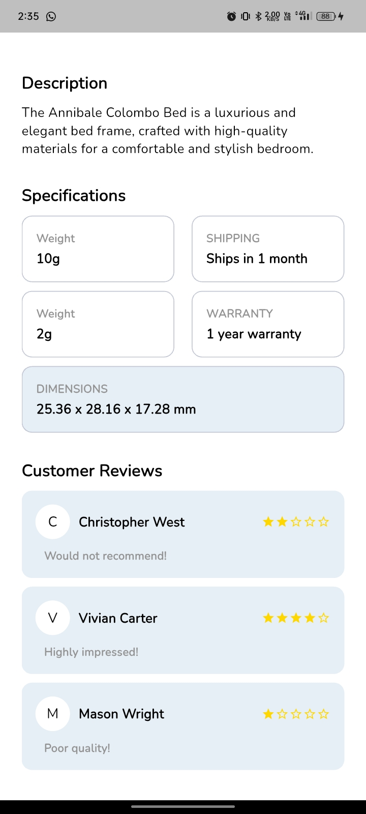
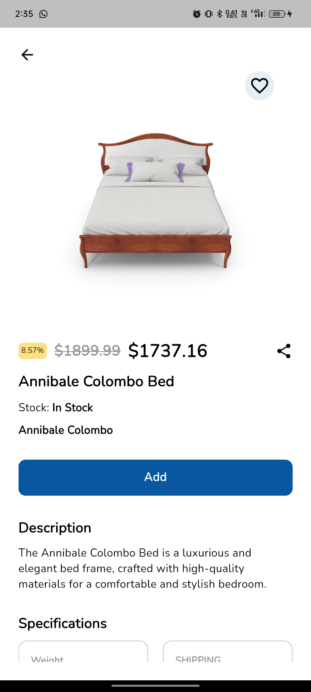
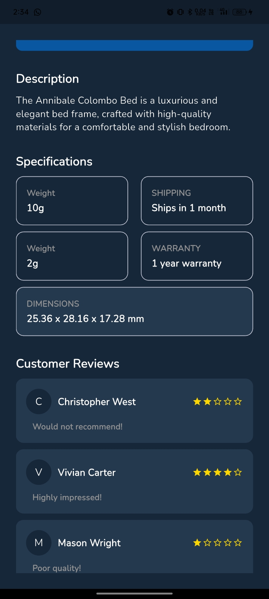
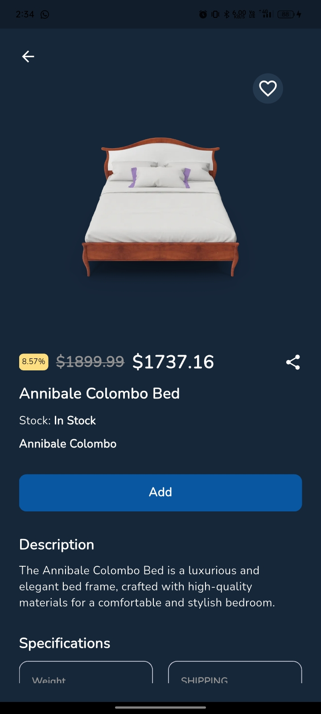
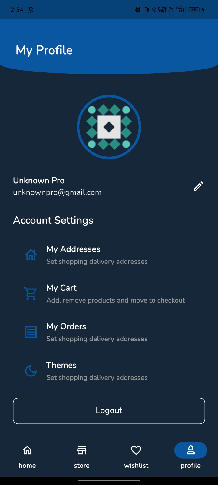
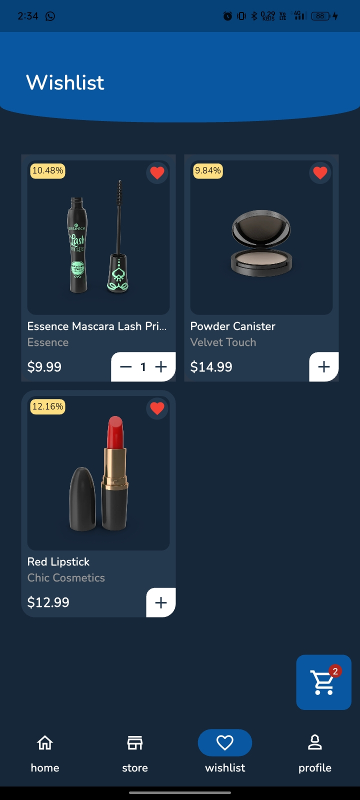
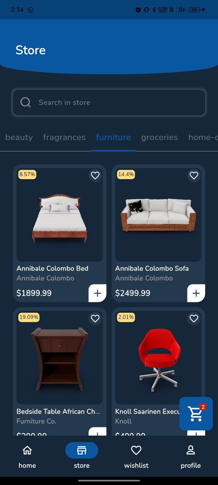
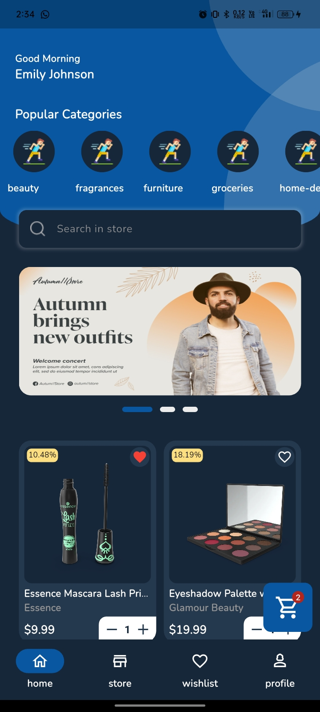
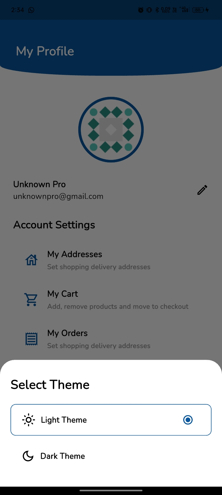
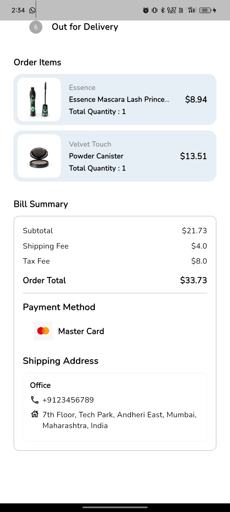
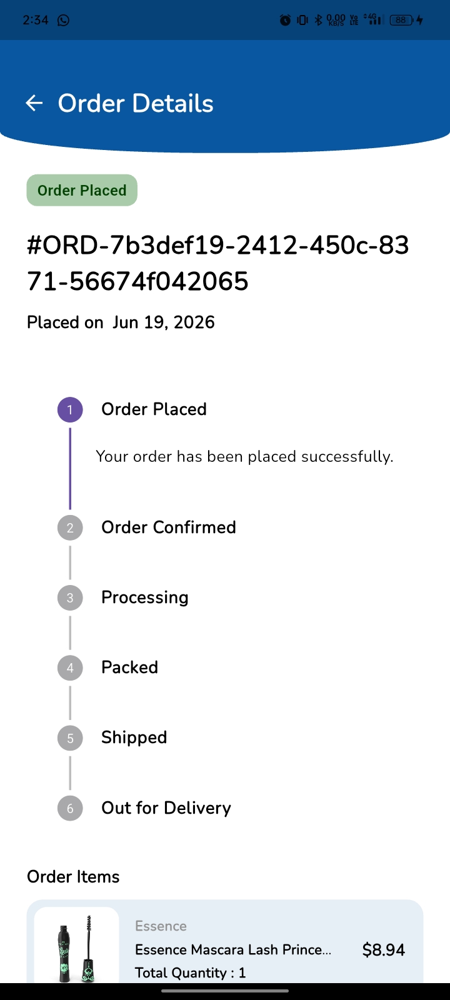
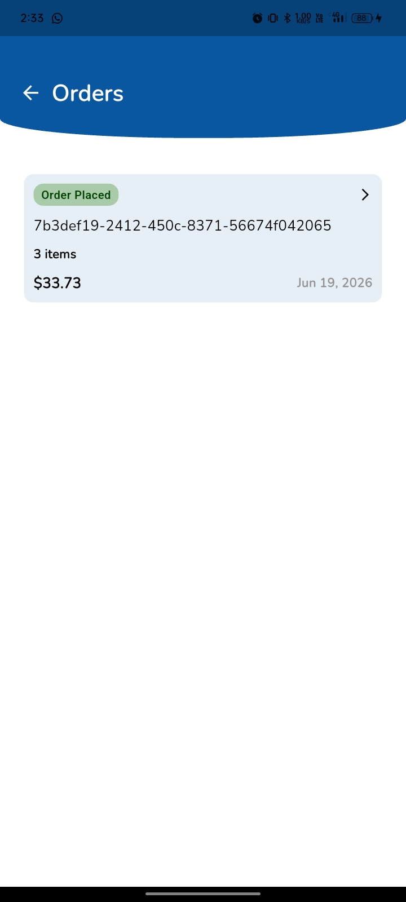
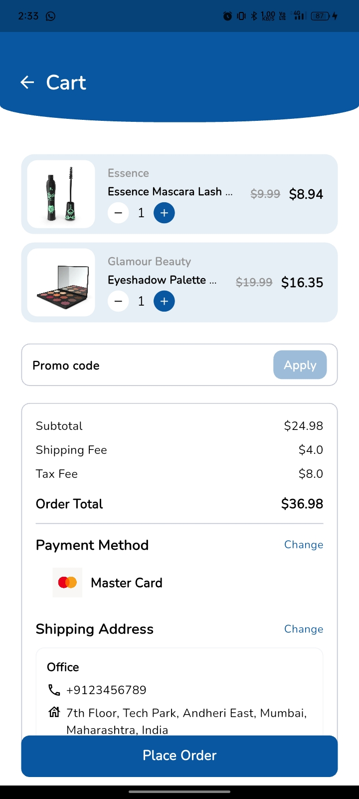
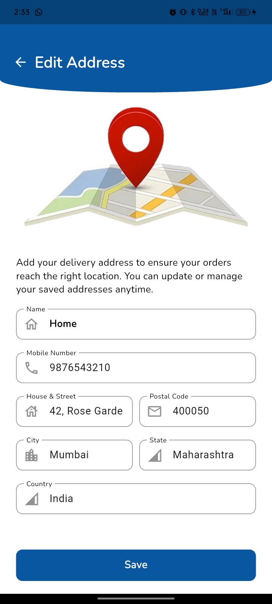
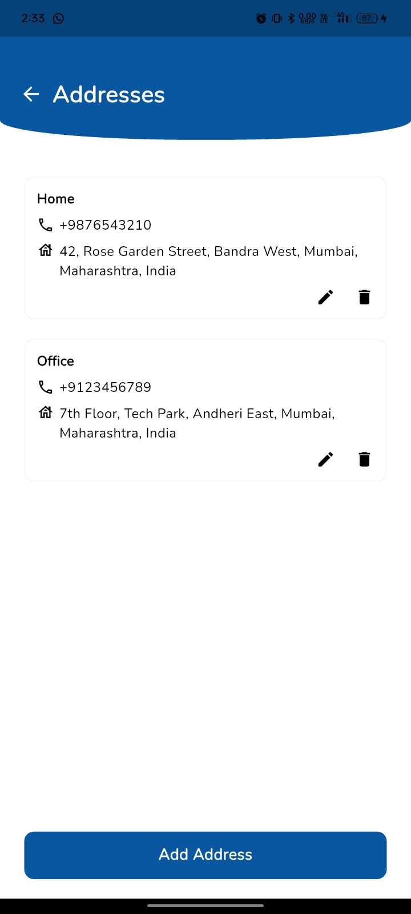
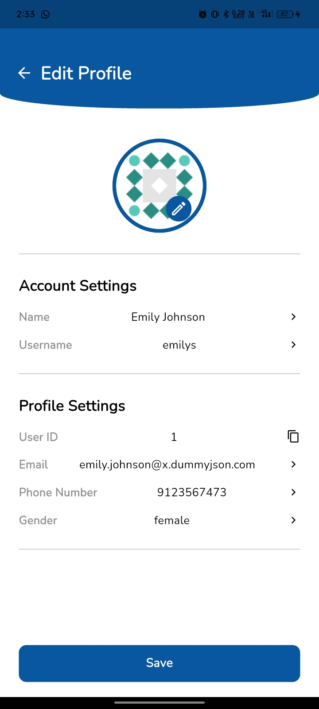
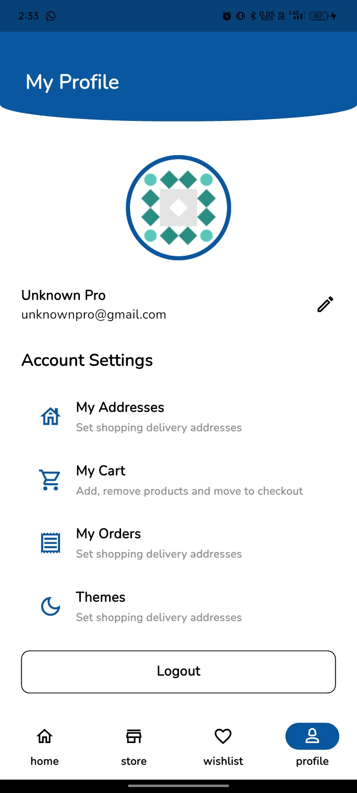
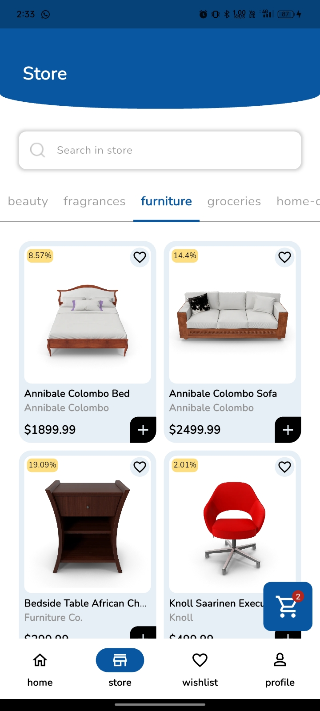
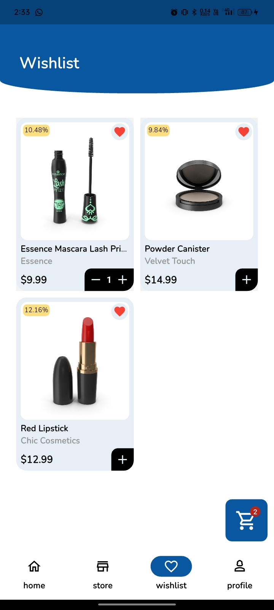
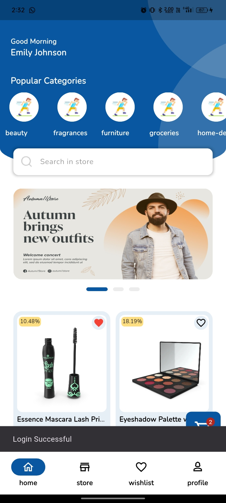
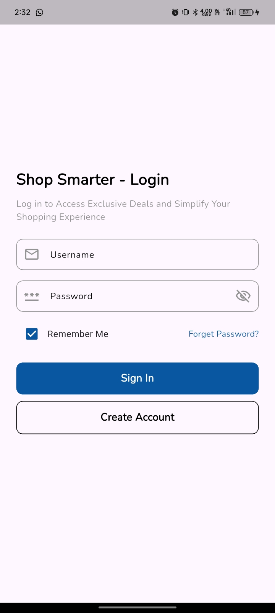


---

For more help getting started with Flutter development, view the [online documentation](https://docs.flutter.dev/).
